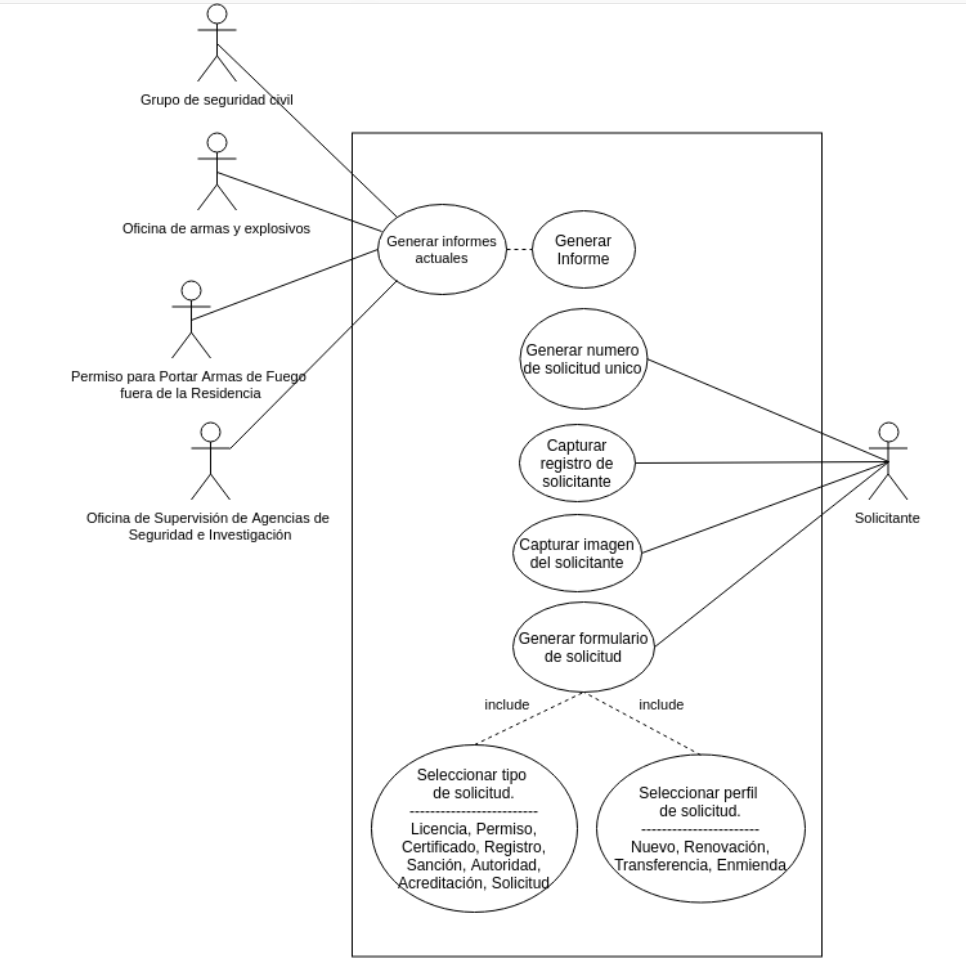
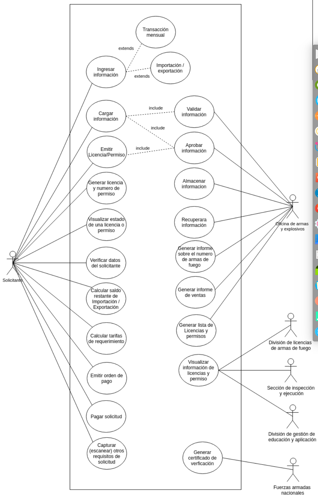
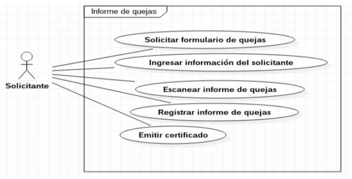
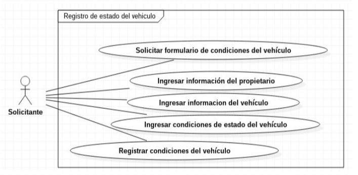
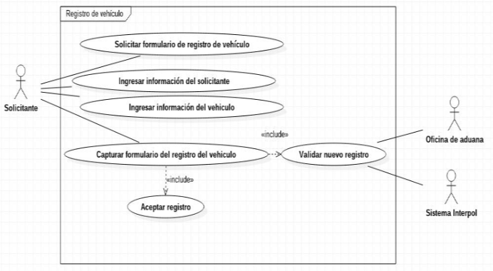
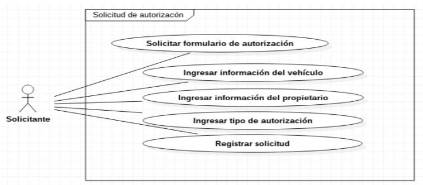

# SIGSO

- [SIGSO](#sigso)
    - [Casos de Uso](#casos-de-uso)
        - [Generar informes](#generar-informes)
        - [Gestión de explosivos](#gesti%C3%B3n-de-explosivos)
        - [Informe de quejas](#informe-de-quejas)
        - [Registro del estado del vehículo](#registro-del-estado-del-veh%C3%ADculo)
        - [Registro de un vehículo](#registro-de-un-veh%C3%ADculo)
        - [Solicitud de autorización](#solicitud-de-autorizaci%C3%B3n)

## Casos de Uso
### Generar informes

### Gestión de explosivos

### Informe de quejas

### Registro del estado del vehículo

### Registro de un vehículo

### Solicitud de autorización

